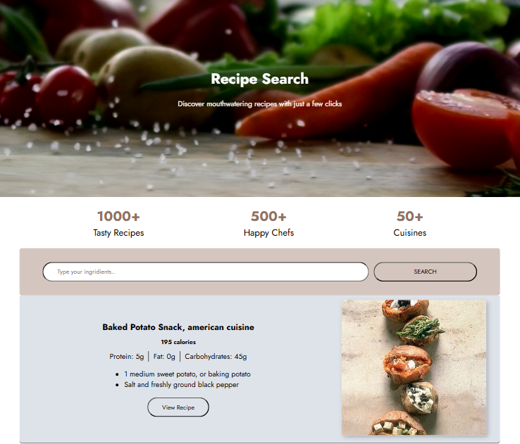

# React + Vite

This template provides a minimal setup to get React working in Vite with HMR and some ESLint rules.

Currently, two official plugins are available:

- [@vitejs/plugin-react](https://github.com/vitejs/vite-plugin-react/blob/main/packages/plugin-react/README.md) uses [Babel](https://babeljs.io/) for Fast Refresh
- [@vitejs/plugin-react-swc](https://github.com/vitejs/vite-plugin-react-swc) uses [SWC](https://swc.rs/) for Fast Refresh
  
## Recipe Finder

## About the Project
**Recipe Finder** is a learning project built with React to practice state management using `useState` and `useEffect`. The application fetches data from the **Edamam API** and allows users to search for recipes by one or multiple ingredients. 

The app is designed to display:
- A list of up to **20 recipes**.
- Detailed nutritional information, including **calories** and **macronutrients** (protein, fat, and carbohydrates).

This project demonstrates effective data rendering using the `map` method and passing props to components.

## Features
- Search recipes by one or more ingredients.
- View calories and macronutrient breakdown (Protein, Fat, Carbs) for each recipe.
- Clean and responsive UI.

## Built With

